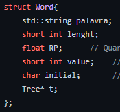
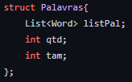
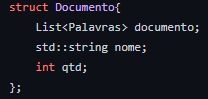
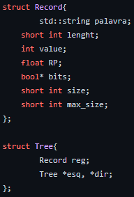
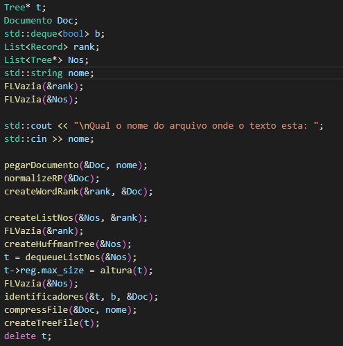
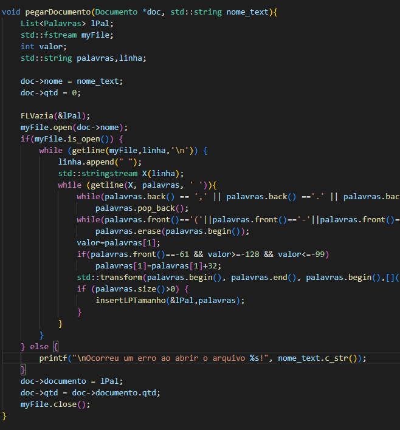

# Implementação código de Huffman para compactar textos

 
 
 

  O objetivo deste código foi elaborar uma árvore binária que utilize o código de Huffman para comprimir arquivos. Para tanto, primeiro precisa-se contabilizar a recorrência de cada palavra (RP) no arquivo, depois normalizar a contabilização entre 0 e 1 utilizando a formula -> RP / (max(RP) - min(RP)), depois montar a árvore com as regras apresentadas por Huffman, depois trocar as palavras pela codificação binária (utilizar booleano para representar 0 e 1), e por último salvar o arquivo em formato binário e observe qual foi o ganho de espaço obtido.

# Estruturas utilizadas

  A primiera estrutura utilizada foi a utilizada para pegar as palavras do texto, está estrutura é uma lista de listas dinâmicas. O nível de estrutra mais baixo desta estrutra de lista de listas é onde a palavra do texto é guardada, o nome dado a ela foi Word. A imagem abaixo mosta está estrutura.
  

    
  

  Na estrutura Word tem-se seis dados sendo eles: 'palavra' que é uma string que gurada a palavra do texto, 'lenght' que é um short int que guarda o tamanho de 'palavra', 'RP' que é um float que guarda o número de vezes que 'palavra' já apareceu no texto, 'value' que é um short int que guarda o valor ASCII de todos os caracteres de 'palavra', 'initial' que é um char que guarda a inicial de 'palavra' e 't' que é um ponteiro para onde 'palavra' vau estar na árvore de Huffman, o porque este dado é importante vai ser explicado depois.
    
  A estrutura acima de Word é Palavras que gurada uma lista dinâmica de Word que possuem o mesmo tamanho. Nela se tem três dados 'listPal' que é a lista dinâmica de Word que guarda as palavras de um certo tamanho, 'tam' que é um int que guarda qual o tamanho das palavras em 'listPal' e 'qtd' que é um int que guarda o número de palavras em 'listPal'. A imagem abaixo ilustra está estrutura.
  

    
  

  E acima de Palavras tem-se Documento, que o último nível de lista de lista, que guarda uma lista dinâmica de Palavras. Nela se tem três dados 'documento' que é uma lista dinâmica de Palavras que guarda todas as palavras do texto separadas em listas por tamanho, 'nome' que é um string que gurada o nome do arquivo  e 'qtd' que é um int que guarda a quantidade de palavras que tem no texto.
  

    
  

  E a última estrutura é Tree que utilizada para criar a árvore de Huffman, ela se baseia em uma árvore binária mais sobre elas em <a href="https://github.com/mpiress/basic_tree">https://github.com/mpiress/basic_tree</a>. Nesta estrutura Tree a uma abaixo dela que é Record que guarda as informações do nó da árvore, nele se tem sete dados sendo eles: 'palavra' que é um string que guarda a palavra salva no nó, 'lenght' que guarda o tamanho de 'palavra', 'RP' que guarda o número de repetições da palavra, 'bits' que é um vetor que guarda o caminho para chegar neste nó, 'size' que guarda o tamanho de 'bits' e 'max_Size' que gurada a altura desta árvore. A imagem abaixo mostra estas estruturas.
  

    
  

# Compactar um texto

  Quando o programa é rodado o usuário tem duas opções 1 - Compactar um texto e 2 - Descompactar um arquivo, primeiro vai ser explicada a opção 1. Quando ela é escolhida as seguintes opercações acontecem: primeiro um texto é informado pelo usuário, depois o texto é pego, depois o RP é normalizado, depois se cria uma lista de rankeamento, depois é criada a floresta de Huffman, depois se cria a árvore de Huffman, depois se pega a altura da árvore, as folhas das árvores recebem seus caminhos, depois o arquivo é comprimido e por último se cria o arquivo onde a árvore será salva. A imagem abaixo ilustra este processo.
  

    
  

  Depois do nome do arquivo do texto ser informado, o método 'pegarDocumento' é chamado nele é se passado um ponteiro de Documento e o nome do arquivo. No método o arquivo com o nome é aberto, se ele não for aberto aparecerá uma mensagem de erro, são pegos dados até achar um '\n' no arquivo, com cada linha de dados vão ser pegos dados separados por ' ', com este dado vai ser tirado qualquer pontuação no início e no fim do dado e passara ele para minuscúlo, este processo vai ser feito até não tiver mais dados a serem pegos no arquivo. Depois dos tratamentos do dado eles serão em uma lista de Palavras, depois de todos os dados forem adicionados na lista eles são adicionados no Documento passado, e por último o arquivo é fechado. A imagem abaixo ilustra o método.
  

    
  

# Compilação e Execução

O código disponibilizado possui um arquivo Makefile que realiza todo o procedimento de compilação e execução. Para tanto, temos as seguintes diretrizes de execução:

| Comando                |  Função                                                                                           |
| -----------------------| ------------------------------------------------------------------------------------------------- |
|  `make clean`          | Apaga a última compilação realizada contida na pasta build                                        |
|  `make`                | Executa a compilação do programa utilizando o gcc, e o resultado vai para a pasta build           |
|  `make run`            | Executa o programa da pasta build após a realização da compilação                                 |

