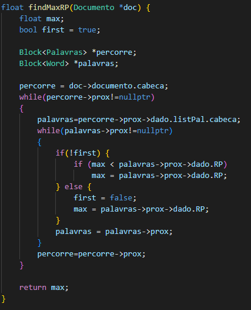
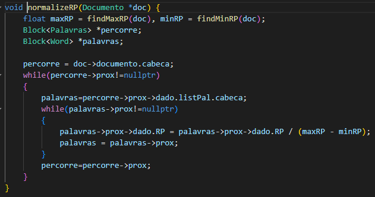
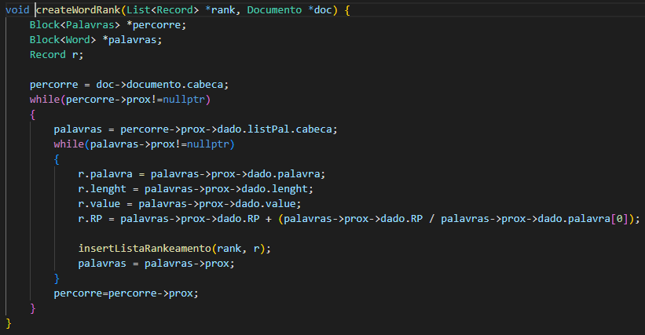
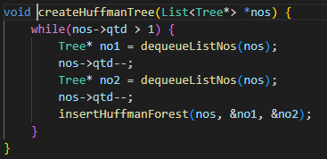
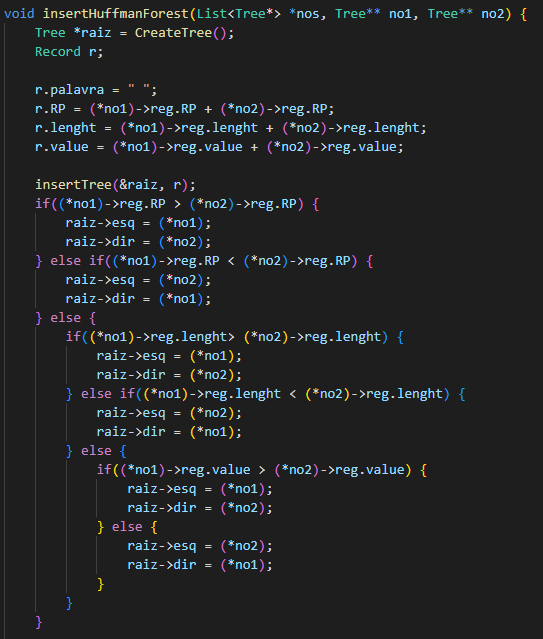
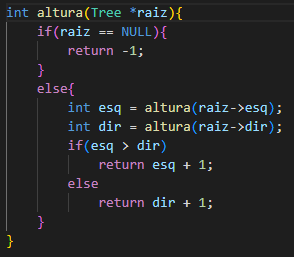
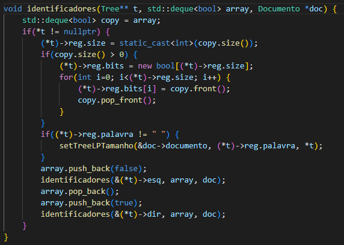

# Implementação código de Huffman para compactar textos

 
 
 

  O objetivo deste código foi elaborar uma árvore binária que utilize o código de Huffman para comprimir arquivos. Para tanto, primeiro precisa-se contabilizar a recorrência de cada palavra (RP) no arquivo, depois normalizar a contabilização entre 0 e 1 utilizando a formula -> RP / (max(RP) - min(RP)), depois montar a árvore com as regras apresentadas por Huffman, depois trocar as palavras pela codificação binária (utilizar booleano para representar 0 e 1), e por último salvar o arquivo em formato binário e observe qual foi o ganho de espaço obtido.

# Estruturas utilizadas

  A primiera estrutura utilizada foi a utilizada para pegar as palavras do texto, está estrutura é uma lista de listas dinâmicas. O nível de estrutra mais baixo desta estrutra de lista de listas é onde a palavra do texto é guardada, o nome dado a ela foi Word. A imagem abaixo mosta está estrutura.
  

    
  

  Na estrutura Word tem-se seis dados sendo eles: 'palavra' que é uma string que gurada a palavra do texto, 'lenght' que é um short int que guarda o tamanho de 'palavra', 'RP' que é um float que guarda o número de vezes que 'palavra' já apareceu no texto, 'value' que é um short int que guarda o valor ASCII de todos os caracteres de 'palavra', 'initial' que é um char que guarda a inicial de 'palavra' e 't' que é um ponteiro para onde 'palavra' vau estar na árvore de Huffman, o porque este dado é importante vai ser explicado depois.
    
  A estrutura acima de Word é Palavras que gurada uma lista dinâmica de Word que possuem o mesmo tamanho. Nela se tem três dados 'listPal' que é a lista dinâmica de Word que guarda as palavras de um certo tamanho, 'tam' que é um int que guarda qual o tamanho das palavras em 'listPal' e 'qtd' que é um int que guarda o número de palavras em 'listPal'. A imagem abaixo ilustra está estrutura.
  

    
  

  E acima de Palavras tem-se Documento, que o último nível de lista de lista, que guarda uma lista dinâmica de Palavras. Nela se tem três dados 'documento' que é uma lista dinâmica de Palavras que guarda todas as palavras do texto separadas em listas por tamanho, 'nome' que é um string que gurada o nome do arquivo  e 'qtd' que é um int que guarda a quantidade de palavras que tem no texto.
  

    
  

  E a última estrutura é Tree que utilizada para criar a árvore de Huffman, ela se baseia em uma árvore binária mais sobre elas em <a href="https://github.com/mpiress/basic_tree">https://github.com/mpiress/basic_tree</a>. Nesta estrutura Tree a uma abaixo dela que é Record que guarda as informações do nó da árvore, nele se tem sete dados sendo eles: 'palavra' que é um string que guarda a palavra salva no nó, 'lenght' que guarda o tamanho de 'palavra', 'RP' que guarda o número de repetições da palavra, 'bits' que é um vetor que guarda o caminho para chegar neste nó, 'size' que guarda o tamanho de 'bits' e 'max_Size' que gurada a altura desta árvore. A imagem abaixo mostra estas estruturas.
  

    
  

# Compactar um texto

  Quando o programa é rodado o usuário tem duas opções 1 - Compactar um texto e 2 - Descompactar um arquivo, primeiro vai ser explicada a opção 1. Quando ela é escolhida as seguintes opercações acontecem: primeiro um texto é informado pelo usuário, depois o texto é pego, depois o RP é normalizado, depois se cria uma lista de rankeamento, depois é criada a floresta de Huffman, depois se cria a árvore de Huffman, depois se pega a altura da árvore, as folhas das árvores recebem seus caminhos, depois o arquivo é comprimido e por último se cria o arquivo onde a árvore será salva. A imagem abaixo ilustra este processo.
  

    
  

  Depois do nome do arquivo do texto ser informado, o método 'pegarDocumento' é chamado nele é se passado um ponteiro de Documento e o nome do arquivo. No método o arquivo com o nome é aberto, se ele não for aberto aparecerá uma mensagem de erro, são pegos dados até achar um '\n' no arquivo, com cada linha de dados vão ser pegos dados separados por ' ', com este dado vai ser tirado qualquer pontuação no início e no fim do dado e passara ele para minuscúlo, este processo vai ser feito até não tiver mais dados a serem pegos no arquivo. Depois dos tratamentos do dado eles serão em uma lista de Palavras, depois de todos os dados forem adicionados na lista eles são adicionados no Documento passado, e por último o arquivo é fechado. A imagem abaixo ilustra o método.
  

    
  

  Depois do método 'pegarDocumento' o método 'normalizeRP' é chamado nele é se passado o ponteiro do Documento criado no método anterior. Antes de explicar este método dois outros métodos são importantes que são 'findMaxRP' e 'findMinRP' que buscam o maior e menor RP respectivamente no Documento passado. O método 'normalizeRP' pega cada Word no Documento passado e atualiza o RP dela para ser igual a ele mesmo divido pelo maior menos o menor RP, pegos pelos métods descritos antes. As imagens abaixo ilustram estes métodos. 
  

    
    
  

  

    
  

  Depois do método 'normalizeRP' o método chamado é o 'createWordRank' nele se é passado um ponteiro de uma lista de Record e o ponteiro do Doumento. Este método pega cada Word no Documento e cria um Record com as informações de Word, o RP é modificado um pouco para tentar não haver RPs iguais. Após Record é criado ele é adiconado na lista de Record passada, nesta lista quando um dado é adicionado ele já é ordenado com ordem sendo em ordem de RP crescente, se algum RP for igual a ordem destes iguas vai ser decrescente com tamanho da palavra, se o tamanho e o RP for igual o valor ASCII é usado para colocar os dados em ordem crescente, e se RP, tamanho e valor forem iguais ele apenas é colocado na frente do elemento onde todos forem iguais.
  

    
  

  Depois do método 'createWordRank' tem se o método 'createListNos' que recebe os ponteiros de duas listas uma de Record e uma de ponteiro de Tree. Este método faz a mesma coisa que o anterior sendo isto ele pega um Record e cria um Tree com ele, adicionando o ponteiro deste Tree sempre no final da lista de ponteiro de Tree, pois os dados já estão ordenados.
    
  Depois do método 'createListNos' vem o método 'createHuffmanTree' que recebe o ponteiro para lista de ponteiro de Tree para criar a árvore de Huffman. Este método ficara rodando até que só tem um elemento na lista, sendo ele a árvore completa, repetindo os seguintes passos: se pega e remove os dois primeiro Tree da lista, eles são pegos usando o método 'dequeueListNos', e os manda para o método 'insertHuffmanForest' junto com a lista. No método 'insertHuffmanForest' o seguinte processo acontece, primeiro um novo Tree é criado com seu 'reg' tendo os dados a seguir palavra sendo ' ', o RP, lenght, e value sendo a soma dos mesmos dados dos dois Tree passados para o método. Depois é se colocado no ponteiro 'esq' do novo Tree o Tree passado que tiver o maior RP e no ponteiro 'dir' o Tree com menor RP, se os RP forem iguais o tamanho é utilizado e se os tamanhos forem iguias o valor ASCII é usado. Após isto este novo Tree é inserido na lista seguindo a mesma lógica de 'createWordRank', ordem de RP crecente e se RP igual ordem de lenght e valor ASCII decrescente. As imagens abaixo mostram os métodos 'createHuffmanTree' e 'insertHuffmanForest'.
  

    
  

  

    
  

  Depois do método 'creataHuffmanTree' o único dado na lista de ponteiro de Tree vai ser a árvore de Huffman, ela é removida da lista e armazenada, depois é usado o método 'altura' para setar o dado max_size do 'reg' da raiz da árvore, no método 'altura' é passado a raiz da árvore. A imagem ilustra o método recursivo 'altura'.
  

    
  

  Depois é chamado 'identificadores' que é passado a raiz da árvore, um deque de bool vazio e o ponteiro do Doumento criado anteriormente. Este método é um recursivo que serve para setar a altura de todos os nós da árvore passada e em todos nós, menos a raiz, vão atualizar no dado 'reg' o valor de bits para ser igual ao deck passado. Nos nós em que a palavra é diferente de ' ' a palavra vai ser procurada no Documento e se achar o dado 't' do Word onde ela foi salva vai receber o ponteiro para o nó da árvore que está palavra está. Depois que os dados do nó forem atualizados o método é chamado para o filho esquerdo e diretiro, só que o deck do esquerdo vai ter um bool false extra no final e no deck do direito um bool true no final. A imagem abaixo ilustra o método recursivo.
  

    
  

# Compilação e Execução

O código disponibilizado possui um arquivo Makefile que realiza todo o procedimento de compilação e execução. Para tanto, temos as seguintes diretrizes de execução:

| Comando                |  Função                                                                                           |
| -----------------------| ------------------------------------------------------------------------------------------------- |
|  `make clean`          | Apaga a última compilação realizada contida na pasta build                                        |
|  `make`                | Executa a compilação do programa utilizando o gcc, e o resultado vai para a pasta build           |
|  `make run`            | Executa o programa da pasta build após a realização da compilação                                 |

